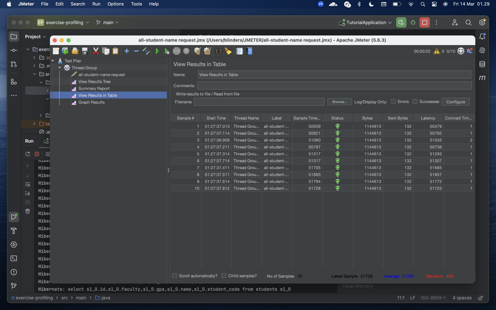
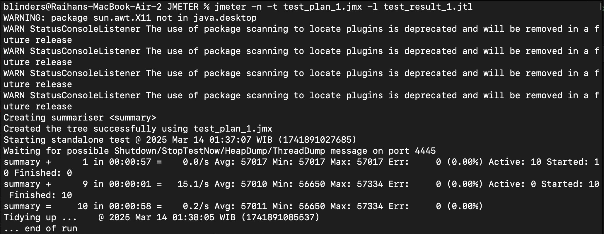
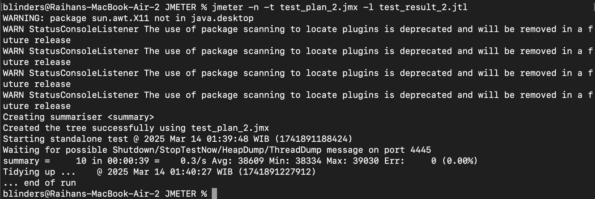
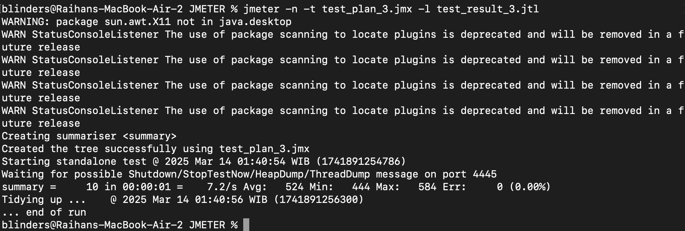
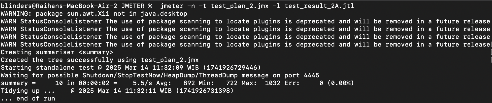
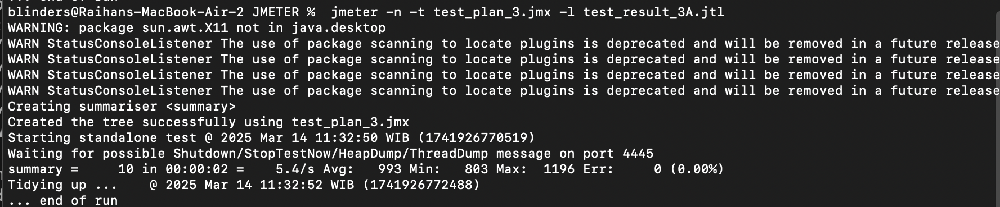

````
Create 2 other test plan for endpoints /all-student-name and /highest-gpa. Perform performance testing as has been done above. Take a screenshot of the results and place it in the README.md file
````
A. all-student-name



B. highest-gpa


````
Run both test plans that you have previously created (for endpoint /highest-gpa and /all-student-name) via the command line, take a screenshot of the results, and include them in the README.md file.
````
A. all-student

B. all-student-name

C. highest-gpa


````
After the profiling and performance optimization process is completed, perform a performance test again using JMeter, see the results, and compare with the first measurement. Is there an improvement from JMeter measurements? Write your conclusion in the README.md file
````
A. all-student

B. all-student-name

C. highest-gpa


After completing the profiling and performance optimization process, we conducted another performance test using JMeter. The results showed a significant improvement: response time decreased for every all-student, all-student-name and highest-gpa and throughput increased for every all-student, all-student-name and highest-gpa. These metrics confirm that our optimizations drastically enhanced the application's efficiency, making it significantly more performant and scalable.
